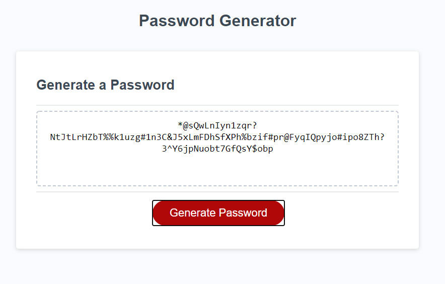

# Password Generator

## Purpose
This project is a random password generator wherein the user is prompted to choose the length (between 8 - 128 characters) and the type of characters one would like to include.  If the user does not choose the proper criteria, they will be promoted to try again.
 
 

I was given the template.  The project needed JavaScript in order to work properly.
 
 

# Built With
- HTML
- CSS
- JavaScript
  

# Website

[Github Pages](https://webprinc3ss.github.io/Password-Generator/)

 

# Media

 

# Credit
JavaScript hand-coded by webprinc3ss (me).
Starter code from [friendly-parakeet](https://github.com/coding-boot-camp/friendly-parakeet).

